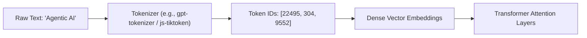
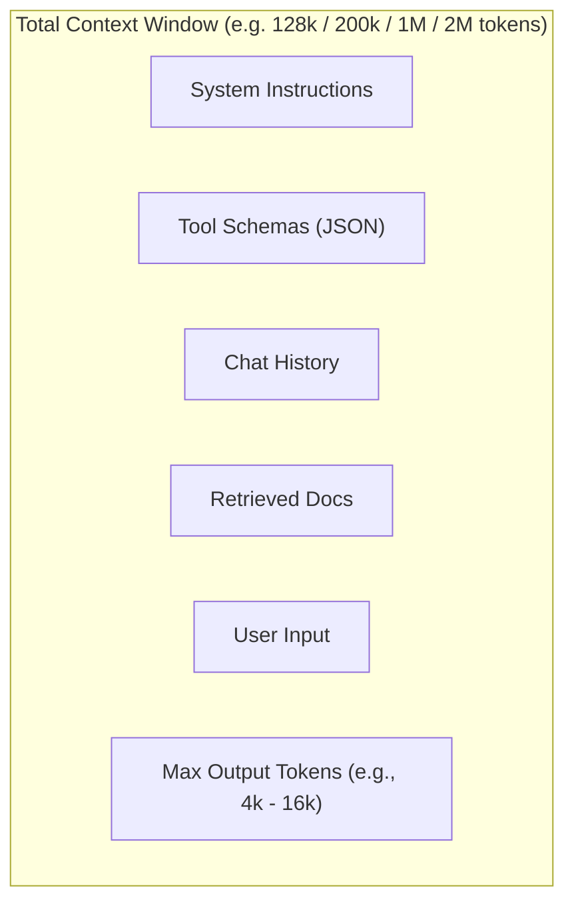
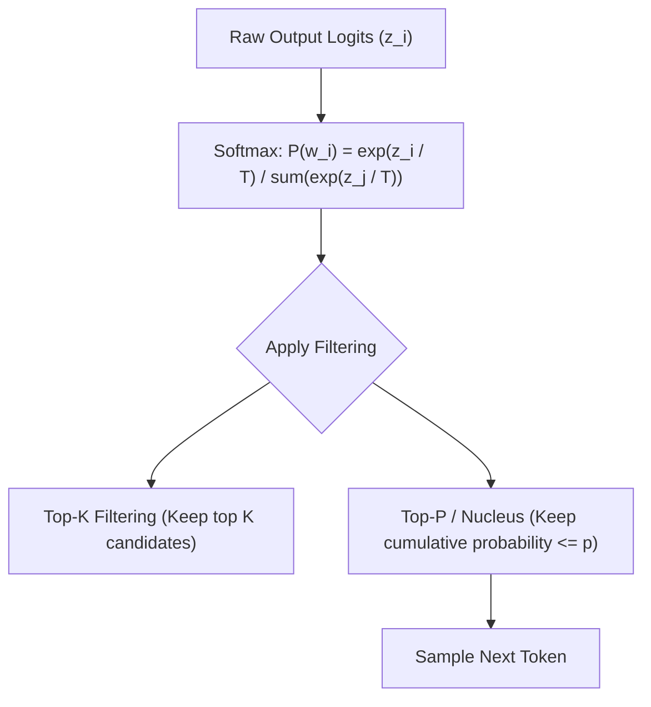
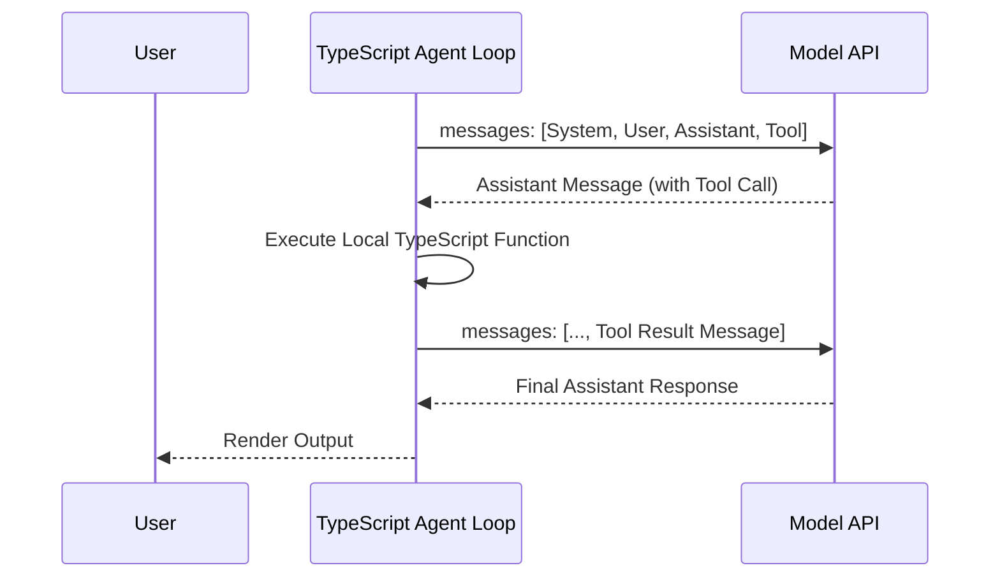

# Module 01: LLM Fundamentals (TypeScript & JavaScript)

## 1. Tokens & Tokenization

### What is a Token?
Large Language Models (LLMs) do not process raw text or strings directly. Instead, they operate on sequences of integer IDs known as **tokens**. Tokens represent common sub-word sequences, characters, or whitespace segments.



### Tokenization Algorithms
- **Byte-Pair Encoding (BPE)**: Used by GPT-4o, Claude, and LLaMA. Recursively merges the most frequent pairs of bytes/characters in a training corpus into single tokens.
- **WordPiece**: Used by BERT. Merges symbols based on likelihood maximization rather than raw frequency.
- **SentencePiece**: Language-independent tokenizer handling whitespace natively (used in Gemini and LLaMA).

### Practical Rules of Thumb & Estimation
- **English Text**: 1 token $\approx 0.75$ words (or 100 tokens $\approx 75$ words / 4 characters per token).
- **Code & JSON**: Code and JSON syntax (spaces, curly braces, quotes) consume tokens faster (~1 token $\approx 2.5 - 3$ characters).
- **Pricing Impact**: LLM APIs bill separately for **Input Tokens** (prompt) and **Output Tokens** (completion). Output tokens are typically 3x–4x more expensive due to autoregressive generation compute.

### TypeScript Example: Token Counting with `gpt-tokenizer`

```typescript
// npm install gpt-tokenizer
import { encode, decode, isWithinTokenLimit } from 'gpt-tokenizer';

interface TokenAnalysis {
  text: string;
  totalTokens: number;
  tokenIds: number[];
  tokenSegments: string[];
}

export function inspectTokens(text: string): TokenAnalysis {
  // 1. Encode text to token IDs
  const tokenIds = encode(text);
  
  // 2. Decode each individual token ID back to text
  const tokenSegments = tokenIds.map((id) => decode([id]));

  return {
    text,
    totalTokens: tokenIds.length,
    tokenIds,
    tokenSegments,
  };
}

// Example usage
const analysis = inspectTokens("Building Agentic AI systems with TypeScript.");
console.log(`Total Tokens: ${analysis.totalTokens}`);
console.log(`Token segments:`, analysis.tokenSegments);

// Check context limit before making API calls
const fitsInBudget = isWithinTokenLimit("Long document content...", 4000);
console.log(`Fits within 4000 token limit: ${fitsInBudget}`);
```

---

## 2. Context Windows & Context Architecture

### Understanding Context Limits
The context window is the maximum number of tokens an LLM can process in a single request (combining system instructions, conversation history, retrieved documents, tool schemas, and generated completion).



### Modern Model Limits (2025/2026)

| Model Family | Context Window | Max Output Tokens | Multi-Modal |
| :--- | :--- | :--- | :--- |
| **GPT-4o** | 128,000 tokens | 16,384 tokens | Text, Vision, Audio |
| **o1 / o3-mini** | 128k - 200k tokens | 65,536 - 100,000 tokens (Reasoning) | Text, Code, Vision |
| **Claude 3.5 / 3.7 Sonnet** | 200,000 tokens | 8,192 tokens | Text, Vision, PDF |
| **Gemini 2.0 Flash / Pro** | 1,000,000 - 2,000,000 tokens | 8,192 tokens | Text, Vision, Audio, Video |
| **DeepSeek V3 / R1** | 64,000 - 128,000 tokens | 8,192 tokens | Text, Code |

### "Lost in the Middle" & Context Degradation
Even with massive context windows (1M+ tokens), LLM attention mechanisms exhibit the **Needle-in-a-Haystack (NIAH)** phenomenon:
- Information placed at the very beginning (Primacy bias) and very end (Recency bias) of the context window is recalled with higher accuracy than information buried in the middle (40% - 70% depth).
- **Agent Best Practice**: Put critical system instructions and tool schemas first, summarized conversation in the middle, and current tool execution results / user queries at the end.

---

## 3. Sampling Parameters & Decoding Strategies

LLMs predict the probability distribution over vocabulary for the next token. Parameters control this sampling distribution.



### Key Parameters Explained

| Parameter | Type | Range | Best Value for Agents & Code | Description |
| :--- | :--- | :--- | :--- | :--- |
| `temperature` | Number | `0.0` - `2.0` | `0.0` | Controls randomness. `0.0` is greedy deterministic (crucial for tool calls & JSON). `0.7 - 1.0` for creative writing. |
| `top_p` (Nucleus) | Number | `0.0` - `1.0` | `1.0` | Samples only from tokens comprising the top $p$ cumulative probability. (Tune `temperature` OR `top_p`, not both). |
| `presence_penalty` | Number | `-2.0` - `2.0` | `0.0` | Penalizes tokens based on whether they appeared so far (encourages new topics). |
| `frequency_penalty`| Number | `-2.0` - `2.0` | `0.0` | Penalizes tokens based on their exact frequency (reduces verbatim repetition). |
| `seed` | Integer | Any Int | e.g. `42` | Helps achieve deterministic, reproducible generations for integration testing. |

---

## 4. Message Roles & Structured Conversations

Modern Chat APIs structure conversations as an array of typed message objects.



### Standard Message Structure in TypeScript

```typescript
import type { ChatCompletionMessageParam } from 'openai/resources/chat/completions';

const messages: ChatCompletionMessageParam[] = [
  {
    role: "system",
    content: "You are an autonomous engineering agent. Output strict JSON only.",
  },
  {
    role: "user",
    content: "Analyze the build logs for service 'auth-api'.",
  },
  {
    role: "assistant",
    content: null,
    tool_calls: [
      {
        id: "call_001",
        type: "function",
        function: {
          name: "fetch_build_logs",
          arguments: JSON.stringify({ service: "auth-api", limit: 50 }),
        },
      },
    ],
  },
  {
    role: "tool",
    tool_call_id: "call_001",
    content: JSON.stringify({ status: "failed", error: "OOMKilled at step 4" }),
  },
  {
    role: "assistant",
    content: "The build failed because the container ran out of memory (OOMKilled) during step 4.",
  },
];
```

---

## 5. Structured Output & Schema Enforcement (Zod + TypeScript)

In agentic systems, guaranteeing that LLM responses match exact TypeScript types is essential for driving business logic without runtime errors.

### 1. Using OpenAI SDK with Native Zod Parsing (`zodResponseFormat`)

```typescript
// npm install openai zod zod-to-json-schema
import OpenAI from 'openai';
import { z } from 'zod';
import { zodResponseFormat } from 'openai/helpers/zod';

const openai = new OpenAI({ apiKey: process.env.OPENAI_API_KEY });

// 1. Define strict Zod Schema
const SubTaskSchema = z.object({
  taskId: z.number().describe("Unique integer ID for the task"),
  description: z.string().describe("Clear, actionable step description"),
  toolNeeded: z.enum(["web_search", "run_query", "none"]).describe("Tool required to execute this step"),
  dependencies: z.array(z.number()).describe("Array of task IDs that must finish first"),
});

const ExecutionPlanSchema = z.object({
  goal: z.string().describe("High-level objective"),
  complexity: z.enum(["low", "medium", "high"]),
  tasks: z.array(SubTaskSchema),
  safetyConsiderations: z.string().optional(),
});

// Infer static TypeScript type from the Zod Schema
export type ExecutionPlan = z.infer<typeof ExecutionPlanSchema>;

// 2. Request deterministic structured output
export async function createAgentPlan(userPrompt: string): Promise<ExecutionPlan> {
  const completion = await openai.beta.chat.completions.parse({
    model: "gpt-4o-2024-08-06",
    messages: [
      {
        role: "system",
        content: "You are a master task planner. Break user goals into ordered DAG subtasks.",
      },
      { role: "user", content: userPrompt },
    ],
    response_format: zodResponseFormat(ExecutionPlanSchema, "execution_plan"),
    temperature: 0.0,
  });

  const parsedPlan = completion.choices[0].message.parsed;
  if (!parsedPlan) {
    throw new Error("Failed to parse structured response from model.");
  }

  return parsedPlan;
}

// Example usage
async function run() {
  const plan = await createAgentPlan("Migrate user database from MySQL to PostgreSQL.");
  console.log(`Goal: ${plan.goal} (Complexity: ${plan.complexity})`);
  for (const task of plan.tasks) {
    console.log(`  [Task ${task.taskId}] ${task.description} (Tool: ${task.toolNeeded}, Deps: [${task.dependencies}])`);
  }
}
```

### 2. Using Vercel AI SDK (`generateObject`)

```typescript
// npm install ai @ai-sdk/openai zod
import { generateObject } from 'ai';
import { openai } from '@ai-sdk/openai';
import { z } from 'zod';

const UserProfileSchema = z.object({
  name: z.string(),
  skills: z.array(z.string()),
  yearsExperience: z.number().int().min(0),
  preferredStack: z.array(z.string()),
});

export async function extractProfile(text: string) {
  const { object } = await generateObject({
    model: openai('gpt-4o'),
    schema: UserProfileSchema,
    prompt: `Extract developer profile details from this resume text:\n${text}`,
  });

  // object is strictly typed as { name: string; skills: string[]; yearsExperience: number; preferredStack: string[] }
  return object;
}
```

---

## 🎯 Summary Checklist
- [x] Token math: Output tokens cost more than input tokens; monitor with `gpt-tokenizer`.
- [x] Context placement: Place system prompt/tool schemas first, critical questions/recent data last.
- [x] Sampling: Always use `temperature: 0` for tool calling and structured data generation.
- [x] Schema Validation: Always use `zod` + `zodResponseFormat` or AI SDK `generateObject` for type-safe guarantees.
