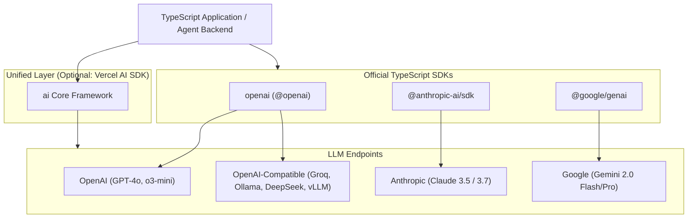

# Module 02: LLM APIs & Provider Ecosystem (TypeScript & JavaScript)

## 1. Provider Ecosystem Overview

Modern TypeScript backends interact with LLMs through official provider SDKs or unified abstraction frameworks like the **Vercel AI SDK** (`ai`).



---

## 2. OpenAI TypeScript SDK

### Installation & Initialization
```bash
npm install openai
```

### Complete Implementation in TypeScript

```typescript
import OpenAI from 'openai';

// Initialize client (reads OPENAI_API_KEY from process.env by default)
const openai = new OpenAI({
  apiKey: process.env.OPENAI_API_KEY,
});

// 1. Standard Chat Completion
export async function runStandardChat(prompt: string): Promise<string> {
  const response = await openai.chat.completions.create({
    model: 'gpt-4o',
    messages: [
      { role: 'system', content: 'You are a senior TypeScript engineer.' },
      { role: 'user', content: prompt },
    ],
    temperature: 0.2,
    max_tokens: 500,
  });

  return response.choices[0]?.message.content ?? '';
}

// 2. Reasoning Models (o1 / o3-mini) with Reasoning Effort
export async function runReasoningTask(complexProblem: string): Promise<string> {
  const response = await openai.chat.completions.create({
    model: 'o3-mini',
    messages: [
      { role: 'user', content: complexProblem },
    ],
    // 'low' | 'medium' | 'high' controls internal thinking token budget
    reasoning_effort: 'medium',
  });

  return response.choices[0]?.message.content ?? '';
}
```

---

## 3. Anthropic Claude TypeScript SDK

Anthropic's SDK features **explicit prompt caching** (which reduces cost by ~90% on multi-turn agents) and **Extended Thinking mode**.

### Installation & Initialization
```bash
npm install @anthropic-ai/sdk
```

### Complete Implementation in TypeScript

```typescript
import Anthropic from '@anthropic-ai/sdk';

const anthropic = new Anthropic({
  apiKey: process.env.ANTHROPIC_API_KEY,
});

// Calling Claude 3.7 / 3.5 Sonnet with Prompt Caching & Thinking
export async function runClaudeWithThinkingAndCaching(task: string): Promise<void> {
  const response = await anthropic.messages.create({
    model: 'claude-3-7-sonnet-20250219',
    max_tokens: 4096,
    // Enable reasoning / extended thinking
    thinking: {
      type: 'enabled',
      budget_tokens: 2048,
    },
    system: [
      {
        type: 'text',
        text: 'You are an enterprise cloud security architect. Enforce zero-trust principles.',
        // Cache static system instructions across agent iterations
        cache_control: { type: 'ephemeral' },
      },
    ],
    messages: [
      { role: 'user', content: task },
    ],
  });

  // Separate thinking steps from final answer
  for (const block of response.content) {
    if (block.type === 'thinking') {
      console.log('🧠 Extended Thinking:\n', block.thinking);
    } else if (block.type === 'text') {
      console.log('💬 Final Answer:\n', block.text);
    }
  }

  // Inspect Prompt Cache stats
  console.log('Usage stats:', {
    inputTokens: response.usage.input_tokens,
    cacheCreationInputTokens: response.usage.cache_creation_input_tokens,
    cacheReadInputTokens: response.usage.cache_read_input_tokens,
    outputTokens: response.usage.output_tokens,
  });
}
```

---

## 4. Google Gemini TypeScript SDK (`@google/genai`)

Google's modern unified SDK for Gemini 2.0 / 1.5 models.

### Installation & Initialization
```bash
npm install @google/genai
```

### Complete Implementation in TypeScript

```typescript
import { GoogleGenAI } from '@google/genai';

const ai = new GoogleGenAI({ apiKey: process.env.GEMINI_API_KEY });

export async function runGeminiTask(userPrompt: string): Promise<string> {
  const response = await ai.models.generateContent({
    model: 'gemini-2.0-flash',
    contents: userPrompt,
    config: {
      systemInstruction: 'You are an expert system designer. Keep answers concise.',
      temperature: 0.1,
      maxOutputTokens: 1000,
    },
  });

  return response.text ?? '';
}

// Multimodal Example: Pass Base64 / Buffer Image
export async function runGeminiVision(imageBase64: string, prompt: string): Promise<string> {
  const response = await ai.models.generateContent({
    model: 'gemini-2.0-flash',
    contents: [
      {
        role: 'user',
        parts: [
          {
            inlineData: {
              mimeType: 'image/jpeg',
              data: imageBase64,
            },
          },
          { text: prompt },
        ],
      },
    ],
  });

  return response.text ?? '';
}
```

---

## 5. OpenAI-Compatible Providers in TypeScript (Groq, Ollama, DeepSeek)

You can reuse the official `openai` npm package for any service providing standard `/v1/chat/completions`.

```typescript
import OpenAI from 'openai';

type SupportedProvider = 'openai' | 'groq' | 'ollama' | 'deepseek' | 'vllm';

export function createLLMClient(provider: SupportedProvider): { client: OpenAI; defaultModel: string } {
  switch (provider) {
    case 'openai':
      return {
        client: new OpenAI({ apiKey: process.env.OPENAI_API_KEY }),
        defaultModel: 'gpt-4o',
      };

    case 'groq':
      return {
        client: new OpenAI({
          baseURL: 'https://api.groq.com/openai/v1',
          apiKey: process.env.GROQ_API_KEY,
        }),
        defaultModel: 'llama-3.3-70b-versatile',
      };

    case 'deepseek':
      return {
        client: new OpenAI({
          baseURL: 'https://api.deepseek.com/v1',
          apiKey: process.env.DEEPSEEK_API_KEY,
        }),
        defaultModel: 'deepseek-chat',
      };

    case 'ollama':
      return {
        client: new OpenAI({
          baseURL: 'http://localhost:11434/v1',
          apiKey: 'ollama', // dummy string required by OpenAI client
        }),
        defaultModel: 'qwen2.5-coder:14b',
      };

    case 'vllm':
      return {
        client: new OpenAI({
          baseURL: 'http://127.0.0.1:8000/v1',
          apiKey: 'EMPTY',
        }),
        defaultModel: 'meta-llama/Llama-3.1-8B-Instruct',
      };
  }
}

// Example usage
async function testGroq() {
  const { client, defaultModel } = createLLMClient('groq');
  const res = await client.chat.completions.create({
    model: defaultModel,
    messages: [{ role: 'user', content: 'Explain Node.js Event Loop in 2 sentences.' }],
  });
  console.log(res.choices[0].message.content);
}
```

---

## 6. Unified Multi-Provider SDK: Vercel AI SDK

The Vercel AI SDK allows swapping between OpenAI, Claude, and Gemini with zero logic refactoring.

```bash
npm install ai @ai-sdk/openai @ai-sdk/anthropic @ai-sdk/google
```

```typescript
import { generateText } from 'ai';
import { openai } from '@ai-sdk/openai';
import { anthropic } from '@ai-sdk/anthropic';
import { google } from '@ai-sdk/google';

export async function askAnyModel(provider: 'openai' | 'anthropic' | 'google', query: string) {
  const model = 
    provider === 'openai' ? openai('gpt-4o') :
    provider === 'anthropic' ? anthropic('claude-3-5-sonnet-latest') :
    google('gemini-2.0-flash');

  const { text, usage } = await generateText({
    model,
    prompt: query,
  });

  console.log(`Tokens used: ${usage.totalTokens}`);
  return text;
}
```

---

## 🎯 Summary Checklist
- [x] Use `openai` npm package for OpenAI, Groq, DeepSeek, and local Ollama.
- [x] Use `@anthropic-ai/sdk` with `cache_control` to reduce token bills on long context agents.
- [x] Use `@google/genai` for 2M token multimodal tasks.
- [x] Use Vercel AI SDK (`ai`) to write clean, provider-agnostic applications.
