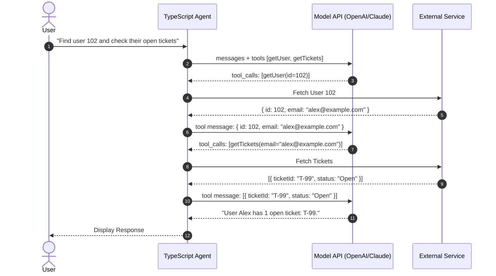
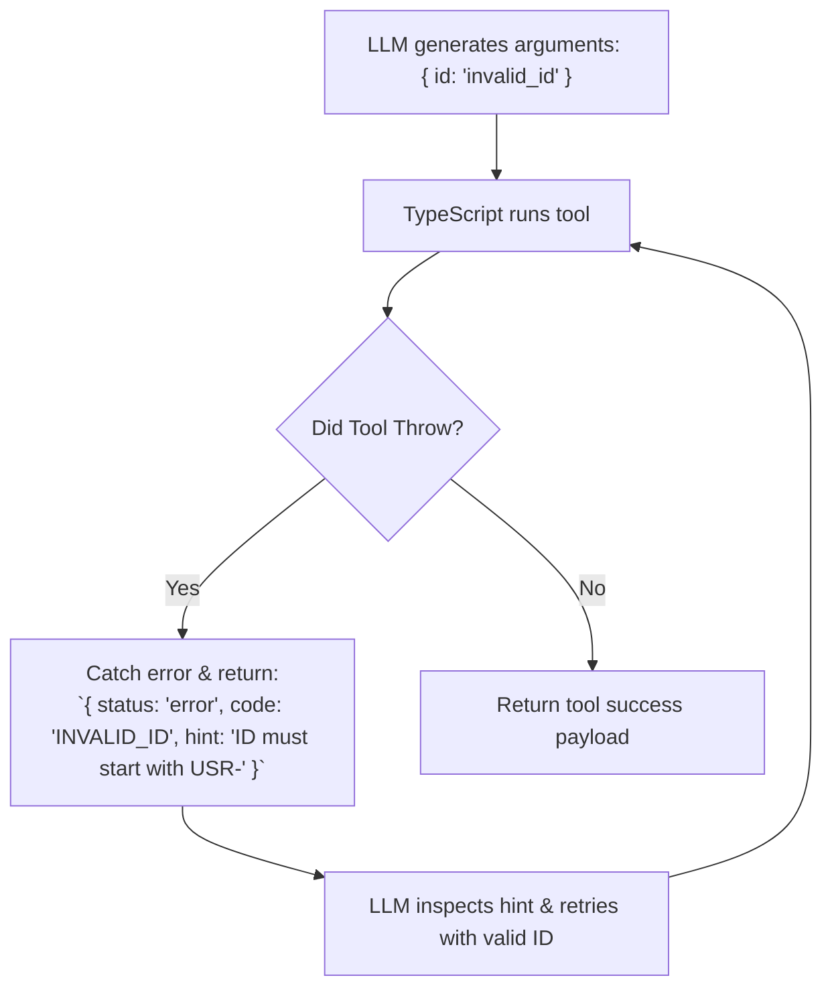

# Module 03: Tool Calling & Function Execution (TypeScript & JavaScript)

## 1. Tool Calling Mechanics

Large Language Models do not execute code or access the internet on their own. **Tool Calling** is an interactive handshake:
1. The TypeScript app supplies tool signatures (name, description, schema).
2. The LLM returns a structured JSON payload identifying the tool and its arguments.
3. The TypeScript app runs the local function/API.
4. The TypeScript app sends the result back to the LLM with `role: "tool"`.
5. The LLM digests the tool's output and either responds to the user or calls another tool.



---

## 2. Defining Tool Schemas with Zod & TypeScript

Writing unambiguous descriptions in your Zod schema is critical because the LLM relies entirely on these descriptions to decide when to call a tool.

```typescript
import { z } from 'zod';
import { zodFunction } from 'openai/helpers/zod';

// 1. Define Zod parameter schemas
export const SearchUsersSchema = z.object({
  query: z.string().describe("Search term matching username, email, or full name"),
  department: z.enum(["engineering", "sales", "support", "all"]).default("all"),
  limit: z.number().int().min(1).max(50).default(10),
});

export type SearchUsersInput = z.infer<typeof SearchUsersSchema>;

// 2. Convert to OpenAI Function Tool Format
export const searchUsersTool = zodFunction({
  name: "search_users",
  parameters: SearchUsersSchema,
  description: "Search corporate directory for employee profiles by keyword and department.",
});
```

---

## 3. Production Tool Execution Loop with OpenAI TypeScript SDK

This implementation handles single and **parallel tool calls** with complete type safety and error containment.

```typescript
import OpenAI from 'openai';
import type { ChatCompletionMessageParam, ChatCompletionTool } from 'openai/resources/chat/completions';

const openai = new OpenAI();

// 1. Real tool business logic
async function fetchStockPrice(args: { ticker: string }): Promise<Record<string, unknown>> {
  const mockPrices: Record<string, number> = { AAPL: 230.5, MSFT: 425.1, GOOGL: 180.25 };
  const price = mockPrices[args.ticker.toUpperCase()];
  if (!price) {
    return { error: `Ticker '${args.ticker}' not found in registry.` };
  }
  return { ticker: args.ticker.toUpperCase(), priceUsd: price, timestamp: new Date().toISOString() };
}

async function convertCurrency(args: { amount: number; from: string; to: string }): Promise<Record<string, unknown>> {
  const mockRates: Record<string, number> = { "USD->EUR": 0.92, "USD->INR": 86.5, "USD->JPY": 155.0 };
  const key = `${args.from.toUpperCase()}->${args.to.toUpperCase()}`;
  const rate = mockRates[key];
  if (!rate) {
    return { error: `Unsupported conversion pair '${key}'.` };
  }
  return {
    originalAmount: args.amount,
    convertedAmount: args.amount * rate,
    rate,
  };
}

// 2. Tool Registry mapping names to async handlers
const TOOL_RUNNERS: Record<string, (args: any) => Promise<Record<string, unknown>>> = {
  fetch_stock_price: fetchStockPrice,
  convert_currency: convertCurrency,
};

// 3. OpenAI Tool Declarations
const tools: ChatCompletionTool[] = [
  {
    type: 'function',
    function: {
      name: 'fetch_stock_price',
      description: 'Get current real-time stock price in USD for a given ticker symbol.',
      parameters: {
        type: 'object',
        properties: {
          ticker: { type: 'string', description: 'Stock ticker symbol (e.g. AAPL, MSFT)' },
        },
        required: ['ticker'],
      },
    },
  },
  {
    type: 'function',
    function: {
      name: 'convert_currency',
      description: 'Convert an amount of money from one currency to another.',
      parameters: {
        type: 'object',
        properties: {
          amount: { type: 'number', description: 'Monetary quantity' },
          from: { type: 'string', description: '3-letter currency code (e.g. USD)' },
          to: { type: 'string', description: '3-letter target currency code (e.g. INR, EUR)' },
        },
        required: ['amount', 'from', 'to'],
      },
    },
  },
];

// 4. Multi-Turn Execution Loop
export async function runToolCallingAgent(userQuery: string, maxTurns = 6): Promise<string> {
  const messages: ChatCompletionMessageParam[] = [
    { role: 'system', content: 'You are an intelligent financial assistant with access to real-time tools.' },
    { role: 'user', content: userQuery },
  ];

  for (let turn = 0; turn < maxTurns; turn++) {
    const response = await openai.chat.completions.create({
      model: 'gpt-4o',
      messages,
      tools,
      tool_choice: 'auto',
      temperature: 0.0,
    });

    const assistantMsg = response.choices[0].message;
    messages.push(assistantMsg);

    // If model didn't call any tools, it has reached its final answer
    if (!assistantMsg.tool_calls || assistantMsg.tool_calls.length === 0) {
      return assistantMsg.content ?? '';
    }

    // Process all tool calls (in parallel if multiple)
    await Promise.all(
      assistantMsg.tool_calls.map(async (toolCall) => {
        const fnName = toolCall.function.name;
        let fnArgs: Record<string, any> = {};
        
        try {
          fnArgs = JSON.parse(toolCall.function.arguments);
        } catch {
          fnArgs = {};
        }

        console.log(`⚙️ Executing tool: ${fnName}(${JSON.stringify(fnArgs)})`);

        let resultPayload: Record<string, unknown>;
        const handler = TOOL_RUNNERS[fnName];

        if (handler) {
          try {
            resultPayload = await handler(fnArgs);
          } catch (err: any) {
            resultPayload = { error: `Execution failed: ${err.message}` };
          }
        } else {
          resultPayload = { error: `Tool ${fnName} is not implemented.` };
        }

        // Push tool output to message history
        messages.push({
          role: 'tool',
          tool_call_id: toolCall.id,
          content: JSON.stringify(resultPayload),
        });
      })
    );
  }

  return 'Agent exceeded maximum turn limit without completing.';
}

// Example Run
async function main() {
  const answer = await runToolCallingAgent(
    'What is the price of 2 AAPL stocks converted into INR?'
  );
  console.log('\nFinal Answer:\n', answer);
}
```

---

## 4. Modern Approach: Vercel AI SDK `tool()` & `generateText()`

The Vercel AI SDK simplifies tool calling into a declarative API that automatically executes tools in a multi-step loop (`maxSteps`).

```typescript
// npm install ai @ai-sdk/openai zod
import { generateText, tool } from 'ai';
import { openai } from '@ai-sdk/openai';
import { z } from 'zod';

export async function runAISDKAgent(prompt: string) {
  const { text, steps } = await generateText({
    model: openai('gpt-4o'),
    maxSteps: 5, // Automatically loop tool calls up to 5 times
    system: 'You are an IT helpdesk automation agent.',
    prompt,
    tools: {
      restartServer: tool({
        description: 'Restart an internal web server by server ID.',
        parameters: z.object({
          serverId: z.string().describe('e.g. srv-prod-01'),
          graceful: z.boolean().default(true),
        }),
        execute: async ({ serverId, graceful }) => {
          console.log(`Restarting server ${serverId} (Graceful: ${graceful})...`);
          return { status: 'restarted', serverId, uptimeSeconds: 0 };
        },
      }),
      getServerHealth: tool({
        description: 'Check CPU and Memory health for a server.',
        parameters: z.object({
          serverId: z.string(),
        }),
        execute: async ({ serverId }) => {
          return { serverId, cpuUsagePercent: 98.4, memoryUsagePercent: 89.2, status: 'unhealthy' };
        },
      }),
    },
  });

  console.log('Total Steps Taken:', steps.length);
  return text;
}
```

---

## 5. Self-Healing & Error Handling

When a tool fails (e.g. invalid query or missing permissions), **never let the node process crash**. Return structured error JSON into the tool message so the model can inspect the error and self-correct.



---

## 🎯 Summary Checklist
- [x] Use `zod` schemas to guarantee parameter types and provide semantic documentation.
- [x] Handle parallel tool calls with `Promise.all` across `assistantMsg.tool_calls`.
- [x] Match every `tool_call.id` with its corresponding `role: "tool"` response.
- [x] Use Vercel AI SDK `tool()` with `maxSteps` for clean declarative agent loops.
