# Module 04: Retrieval-Augmented Generation (RAG) (TypeScript & JavaScript)

## 1. RAG Architecture in Node.js & TypeScript

Retrieval-Augmented Generation (RAG) injects external knowledge into the LLM context window at query time.

```mermaid
flowchart TD
    subgraph Ingestion ["1. Document Ingestion (Offline/Batch)"]
        RawDocs["Docs (Markdown, PDF, HTML)"] --> RecursiveSplit["Recursive Character Splitter"]
        RecursiveSplit --> EmbeddingsAPI["Embedding API (OpenAI / Cohere)"]
        EmbeddingsAPI --> VectorDB[("Vector Database (Qdrant / Pinecone / pgvector)")]
    end

    subgraph QueryPipeline ["2. Query, Retrieval & Reranking"]
        UserQuery["User Query"] --> EmbedQuery["Embed Query Vector"]
        EmbedQuery --> DenseSearch["Dense Vector Search"]
        UserQuery --> BM25Search["BM25 Lexical Search"]
        DenseSearch & BM25Search --> RRF["Reciprocal Rank Fusion (RRF)"]
        RRF --> Candidates["Top 25 Candidates"]
        Candidates --> CohereRerank["Cross-Encoder Reranker (Cohere)"]
        CohereRerank --> Top3["Top 3 Re-ranked Chunks"]
    end

    subgraph Generation ["3. Augmented Generation"]
        Top3 --> PromptAssembler["Prompt Context Assembler"]
        UserQuery --> PromptAssembler
        PromptAssembler --> LLMGen["LLM Generation (GPT-4o / Claude 3.5)"]
        LLMGen --> Answer["Grounded Answer with Sources"]
    end
```



---

## 2. Vector Math & Embeddings in TypeScript

### Cosine Similarity & Vector Operations

```typescript
// Cosine similarity between two float vectors
export function cosineSimilarity(vecA: number[], vecB: number[]): number {
  if (vecA.length !== vecB.length) {
    throw new Error('Vectors must have identical dimensions');
  }

  let dotProduct = 0;
  let normA = 0;
  let normB = 0;

  for (let i = 0; i < vecA.length; i++) {
    dotProduct += vecA[i] * vecB[i];
    normA += vecA[i] * vecA[i];
    normB += vecB[i] * vecB[i];
  }

  const magnitude = Math.sqrt(normA) * Math.sqrt(normB);
  return magnitude === 0 ? 0 : dotProduct / magnitude;
}
```

---

## 3. Recursive Character Text Splitter in TypeScript

```typescript
interface ChunkOptions {
  chunkSize: number;
  chunkOverlap: number;
  separators?: string[];
}

export function recursiveCharacterSplitter(
  text: string,
  options: ChunkOptions = { chunkSize: 500, chunkOverlap: 50 }
): string[] {
  const separators = options.separators ?? ['\n\n', '\n', '. ', ' ', ''];
  const chunks: string[] = [];

  function split(textToSplit: string, separatorIndex: number) {
    if (textToSplit.length <= options.chunkSize || separatorIndex >= separators.length) {
      if (textToSplit.trim().length > 0) {
        chunks.push(textToSplit.trim());
      }
      return;
    }

    const sep = separators[separatorIndex];
    const parts = textToSplit.split(sep);
    let currentChunk = '';

    for (const part of parts) {
      const candidate = currentChunk ? `${currentChunk}${sep}${part}` : part;
      if (candidate.length <= options.chunkSize) {
        currentChunk = candidate;
      } else {
        if (currentChunk) {
          chunks.push(currentChunk.trim());
        }
        if (part.length > options.chunkSize) {
          // Recurse with finer separator
          split(part, separatorIndex + 1);
          currentChunk = '';
        } else {
          currentChunk = part;
        }
      }
    }

    if (currentChunk.trim()) {
      chunks.push(currentChunk.trim());
    }
  }

  split(text, 0);
  return chunks;
}
```

---

## 4. Hybrid Search & Reciprocal Rank Fusion (RRF)

Combines dense semantic search (vector) with sparse lexical search (BM25/keyword).

$$RRF(d) = \sum_{m \in M} \frac{1}{k + r_m(d)}$$

```typescript
export interface RankedItem {
  id: string;
  score: number;
}

export function reciprocalRankFusion(
  denseRankings: string[],
  sparseRankings: string[],
  k = 60
): RankedItem[] {
  const scoreMap = new Map<string, number>();

  // Accumulate dense ranks
  denseRankings.forEach((docId, rank) => {
    const current = scoreMap.get(docId) ?? 0;
    scoreMap.set(docId, current + 1 / (k + rank + 1));
  });

  // Accumulate sparse ranks
  sparseRankings.forEach((docId, rank) => {
    const current = scoreMap.get(docId) ?? 0;
    scoreMap.set(docId, current + 1 / (k + rank + 1));
  });

  // Sort descending by merged score
  return Array.from(scoreMap.entries())
    .map(([id, score]) => ({ id, score }))
    .sort((a, b) => b.score - a.score);
}
```

---

## 5. Reranking with Cross-Encoders (Cohere in TypeScript)

```typescript
// npm install cohere-ai
import { CohereClient } from 'cohere-ai';

const cohere = new CohereClient({ token: process.env.COHERE_API_KEY });

export async function rerankChunks(
  query: string,
  documents: string[],
  topN = 3
): Promise<string[]> {
  const reranked = await cohere.v2.rerank({
    model: 'rerank-v3.5',
    query,
    documents,
    topN,
  });

  return reranked.results.map((res) => documents[res.index]);
}
```

---

## 6. Complete End-to-End TypeScript RAG Implementation

```typescript
import OpenAI from 'openai';

const openai = new OpenAI();

interface DocumentChunk {
  id: string;
  text: string;
  embedding?: number[];
}

// 1. In-memory Knowledge Base
const KNOWLEDGE_BASE: DocumentChunk[] = [
  {
    id: 'doc-1',
    text: 'Standard customer refunds are processed within 5 to 7 business days to the original credit card.',
  },
  {
    id: 'doc-2',
    text: 'Enterprise SLA guarantees 99.99% uptime with 24/7 priority phone and Slack channel support.',
  },
  {
    id: 'doc-3',
    text: 'API Rate Limits: Free tier allows 60 requests/min; Enterprise tier allows 10,000 requests/min.',
  },
  {
    id: 'doc-4',
    text: 'All user data is encrypted at rest using AES-256 and in transit via TLS 1.3.',
  },
];

// 2. Compute Embeddings via OpenAI
async function createEmbedding(text: string): Promise<number[]> {
  const response = await openai.embeddings.create({
    model: 'text-embedding-3-small',
    input: text,
  });
  return response.data[0].embedding;
}

// Helper: Cosine Similarity
function cosineSimilarity(a: number[], b: number[]): number {
  let dot = 0, normA = 0, normB = 0;
  for (let i = 0; i < a.length; i++) {
    dot += a[i] * b[i];
    normA += a[i] * a[i];
    normB += b[i] * b[i];
  }
  return dot / (Math.sqrt(normA) * Math.sqrt(normB));
}

// 3. Ingestion (Generate Vector Indexes)
async function initializeKnowledgeBase() {
  for (const doc of KNOWLEDGE_BASE) {
    if (!doc.embedding) {
      doc.embedding = await createEmbedding(doc.text);
    }
  }
}

// 4. Retrieval Step
async function retrieveTopChunks(query: string, topK = 2): Promise<string[]> {
  const queryVec = await createEmbedding(query);

  const scored = KNOWLEDGE_BASE.map((doc) => ({
    text: doc.text,
    similarity: cosineSimilarity(queryVec, doc.embedding!),
  }));

  scored.sort((a, b) => b.similarity - a.similarity);
  return scored.slice(0, topK).map((item) => item.text);
}

// 5. Augmented Generation
export async function answerRAGQuery(userQuestion: string): Promise<string> {
  await initializeKnowledgeBase();

  const contextChunks = await retrieveTopChunks(userQuestion, 2);
  const contextString = contextChunks.map((chunk, idx) => `[Source ${idx + 1}]: ${chunk}`).join('\n\n');

  const systemPrompt = `You are a verified enterprise support assistant.
Answer the user's question strictly based ONLY on the provided Context below.
If the Context does not contain the answer, respond: "I do not have enough information to answer this question."

Context:
${contextString}`;

  const completion = await openai.chat.completions.create({
    model: 'gpt-4o',
    messages: [
      { role: 'system', content: systemPrompt },
      { role: 'user', content: userQuestion },
    ],
    temperature: 0.0,
  });

  return completion.choices[0]?.message.content ?? '';
}

// Run Query
async function run() {
  const answer = await answerRAGQuery('What is the enterprise uptime guarantee and how fast are refunds?');
  console.log('--- Grounded RAG Output ---\n', answer);
}
```

---

## 🎯 Summary Checklist
- [x] Embeddings convert unstructured text into high-dimensional geometric vectors.
- [x] Recursive chunking keeps sentences and paragraphs coherent.
- [x] Hybrid search (Dense + BM25 + RRF) solves both semantic matching and exact keyword lookup.
- [x] Cross-encoder rerankers (like Cohere) maximize top-k relevance before prompt injection.
