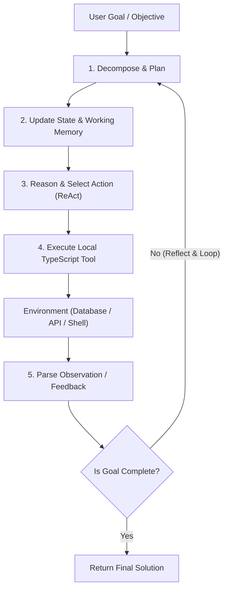
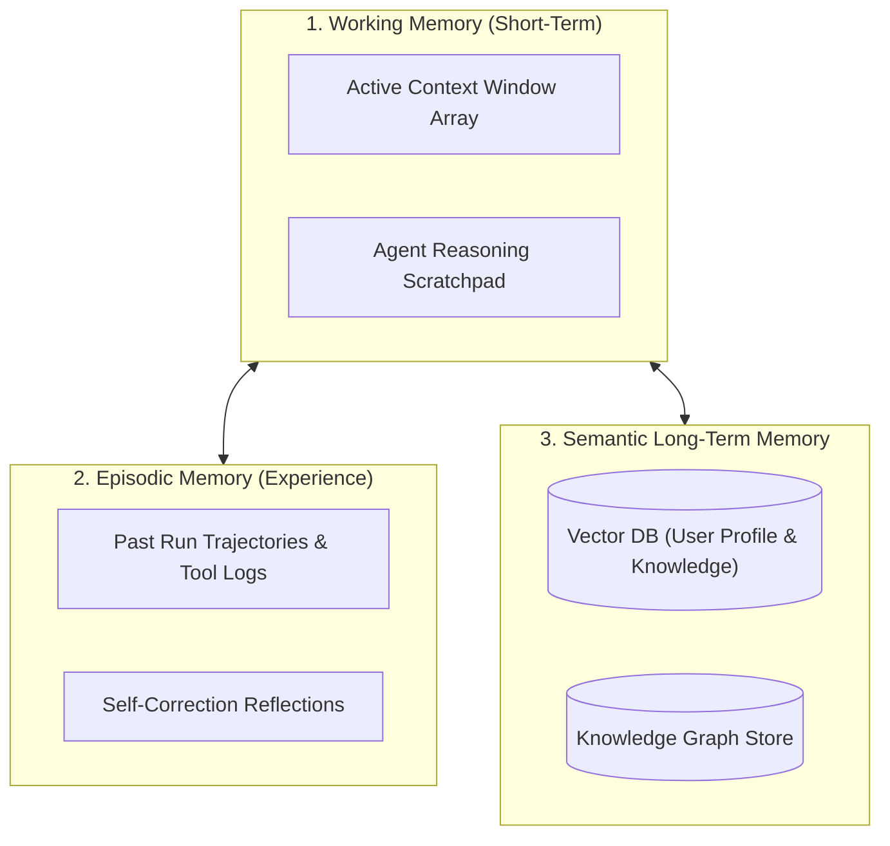

# Module 05: Autonomous Agents (TypeScript & JavaScript)

## 1. Single-Agent Cognitive Architecture

An **Autonomous AI Agent** is a software system where an LLM orchestrates planning, tool execution, memory retrieval, and self-reflection to accomplish multi-step objectives.



---

## 2. Core Agent Cognitive Frameworks

| Paradigm | Workflow | Ideal Use Case |
| :--- | :--- | :--- |
| **ReAct (Reason + Act)** | Interleaves `Thought` $\to$ `Action` $\to$ `Observation` step-by-step. | Real-time debugging, API exploration, interactive search. |
| **Plan-and-Solve** | Emits an explicit multi-step DAG plan upfront, then executes tasks sequentially or in parallel. | Batch pipelines, content generation, multi-stage reports. |
| **Reflexion** | Evaluates past execution failures and writes an internal critique before re-planning. | Writing code, fixing syntax errors, math reasoning. |
| **Tree of Thoughts (ToT)** | Explores and scores multiple alternative reasoning paths with backtracking. | Game strategy, architecture trade-off evaluation. |

---

## 3. Agent Memory Systems in TypeScript



### Managing Token Limits with a Sliding Window Buffer

```typescript
import type { ChatCompletionMessageParam } from 'openai/resources/chat/completions';

export class AgentMemoryBuffer {
  private messages: ChatCompletionMessageParam[] = [];
  private maxTurns: number;

  constructor(maxTurns = 10) {
    this.maxTurns = maxTurns;
  }

  public addMessage(msg: ChatCompletionMessageParam) {
    this.messages.push(msg);
  }

  public getContextWindow(systemPrompt: string): ChatCompletionMessageParam[] {
    // Retain initial system instructions + most recent N messages
    const recentMessages = this.messages.slice(-this.maxTurns * 2);
    return [{ role: 'system', content: systemPrompt }, ...recentMessages];
  }

  public clear() {
    this.messages = [];
  }
}
```

---

## 4. Multi-Step Execution & Loop Prevention

To build production-safe autonomous agents:
1. **Hard Step Limits (`maxSteps = 10`)**: Prevents runaway billing.
2. **Duplicate Action Detection**: Detects if the agent repeats identical tool calls with identical parameters in consecutive iterations.
3. **Graceful Degradation**: Returns the best partial solution if external services timeout.

---

## 5. Complete ReAct Agent from Scratch in TypeScript (Zero Frameworks)

A complete, self-contained ReAct agent implementation in pure TypeScript:

```typescript
import OpenAI from 'openai';

const openai = new OpenAI();

// 1. Tool Implementations
async function searchHardwareInventory(input: string): Promise<string> {
  const inventory: Record<string, string> = {
    macbook: 'Apple MacBook Pro M3 Max - Price: $3,200 (In Stock: 8)',
    monitor: 'Dell UltraSharp 32" 4K - Price: $850 (In Stock: 5)',
    keyboard: 'Keychron Q3 Pro Wireless - Price: $210 (In Stock: 15)',
    mouse: 'Logitech MX Master 3S - Price: $99 (In Stock: 22)',
  };

  const key = Object.keys(inventory).find((k) => input.toLowerCase().includes(k));
  return key ? inventory[key] : 'Error: Item not found in inventory catalog.';
}

async function evaluateMath(expression: string): Promise<string> {
  try {
    // Safe character filter before evaluation
    if (!/^[0-9+\-*/().\s]+$/.test(expression)) {
      return 'Error: Invalid math expression.';
    }
    const result = Function(`"use strict"; return (${expression})`)();
    return String(result);
  } catch (err: any) {
    return `Error: ${err.message}`;
  }
}

// Map tool names to handler functions
const TOOLS: Record<string, (arg: string) => Promise<string>> = {
  search_inventory: searchHardwareInventory,
  calculate: evaluateMath,
};

// 2. ReAct Structured Prompt Template
const SYSTEM_PROMPT = `
You are an autonomous operations assistant. Solve the user's task step-by-step using the ReAct (Reasoning + Acting) loop.

Available Tools:
1. search_inventory(query: string) -> Lookup product price and stock availability.
2. calculate(expression: string) -> Evaluate mathematical equations.

You MUST strictly follow this exact format:

Question: the input problem you must solve
Thought: your reasoning about what to do next
Action: tool_name
Action Input: single string argument for the tool
Observation: result of the tool
... (Thought/Action/Action Input/Observation can repeat up to 6 times)
Thought: I have determined the complete answer
Final Answer: the final comprehensive response to the user.
`;

// 3. Autonomous Execution Engine
export async function runReactAgent(userQuestion: string, maxSteps = 6): Promise<string> {
  let scratchpad = `Question: ${userQuestion}\n`;
  console.log(`\n🚀 Starting ReAct Agent: "${userQuestion}"\n${'='.repeat(60)}`);

  for (let step = 0; step < maxSteps; step++) {
    const prompt = `${SYSTEM_PROMPT}\n\n${scratchpad}`;

    const completion = await openai.chat.completions.create({
      model: 'gpt-4o',
      messages: [{ role: 'user', content: prompt }],
      temperature: 0.0,
      stop: ['Observation:'], // Stop generating once the LLM outputs Action Input
    });

    const stepOutput = completion.choices[0]?.message.content?.trim() ?? '';
    console.log(stepOutput);
    scratchpad += `${stepOutput}\n`;

    // Check if Final Answer has been reached
    if (stepOutput.includes('Final Answer:')) {
      const finalAnswer = stepOutput.split('Final Answer:').pop()?.trim();
      return finalAnswer ?? stepOutput;
    }

    // Parse Action & Action Input
    const actionMatch = stepOutput.match(/Action:\s*(.*?)\nAction Input:\s*(.*)/s);
    if (!actionMatch) {
      console.warn('⚠️ Parse warning: LLM did not follow Action format.');
      break;
    }

    const toolName = actionMatch[1].trim();
    const toolInput = actionMatch[2].trim().replace(/^['"]|['"]$/g, '');

    // Execute tool
    let observation: string;
    if (TOOLS[toolName]) {
      try {
        observation = await TOOLS[toolName](toolInput);
      } catch (err: any) {
        observation = `Error executing tool: ${err.message}`;
      }
    } else {
      observation = `Error: Tool '${toolName}' is not defined.`;
    }

    const obsText = `Observation: ${observation}\n`;
    console.log(obsText);
    scratchpad += obsText;
  }

  return 'Agent stopped: Step limit reached before finding Final Answer.';
}

// Run Demo
async function run() {
  const query = 'We want to buy 2 MacBook laptops and 3 Keychron keyboards. What is the total cost?';
  const result = await runReactAgent(query);
  console.log(`\n🎯 Final Response:\n${result}`);
}
```

---

## 🎯 Summary Checklist
- [x] Autonomous Loop: Sense $\to$ Think $\to$ Act $\to$ Observe $\to$ Conclude.
- [x] Multi-Tier Memory: Maintain working memory buffers and persist long-term facts.
- [x] Protect against recursion: Add hard step caps and loop-detection triggers.
- [x] Zero-framework ReAct engine: Understand prompt parsing and tool observation mechanics.
