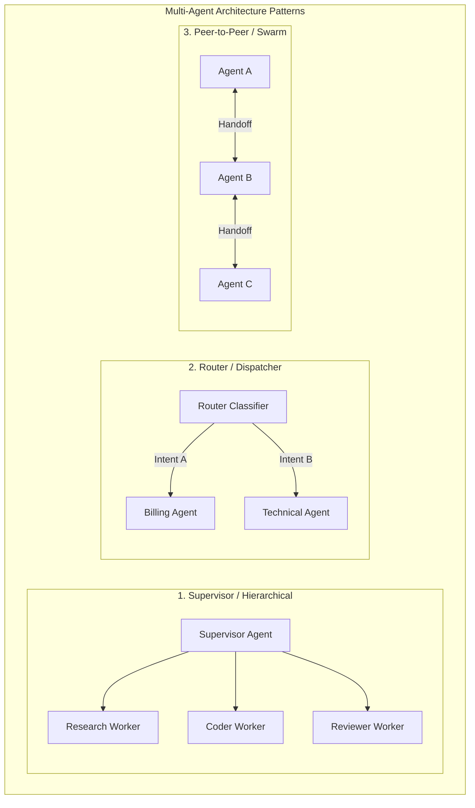
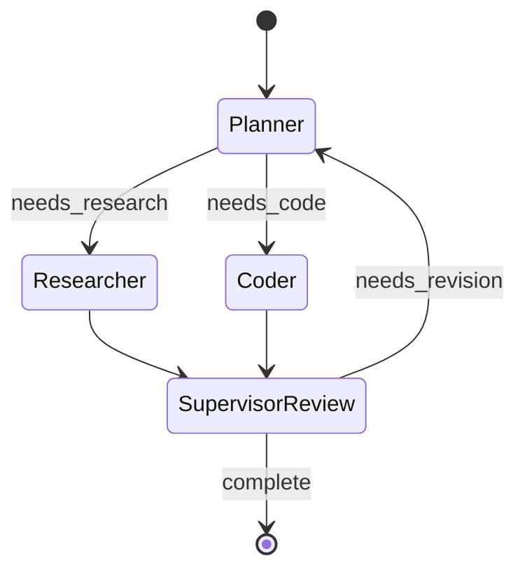

# Module 06: Agent Orchestration & Multi-Agent Systems (TypeScript & JavaScript)

## 1. Multi-Agent Orchestration Topologies

When single agents grow beyond 10+ tools or complex workflows, single prompt context windows become overloaded and brittle. **Multi-Agent Orchestration** separates concerns across specialized sub-agents.



| Topology | Control Flow | Best For |
| :--- | :--- | :--- |
| **Supervisor** | Centralized planner routes tasks to worker agents and aggregates their outputs. | Complex research, software generation, multi-stage pipelines. |
| **Router** | Classifies incoming intent once and delegates to a single specialized domain agent. | Enterprise customer service, multi-department ticketing. |
| **Swarm / Peer Handoff** | Agents directly transfer active conversation context to another agent (`transferToBilling`). | Interactive customer journeys requiring dynamic handoffs. |
| **Sequential / Pipeline** | Agent A $\to$ Agent B $\to$ Agent C (Fixed DAG). | Data enrichment, translation $\to$ validation $\to$ publication. |

---

## 2. LangGraph.js (`@langchain/langgraph`)

LangGraph is the premier state-graph framework for coordinating cyclic, multi-agent workflows with checkpointing, time-travel debugging, and human-in-the-loop approvals.



### Installation
```bash
npm install @langchain/langgraph @langchain/core @langchain/openai
```

### Complete LangGraph.js Multi-Agent Implementation

```typescript
import { StateGraph, END, START, Annotation } from '@langchain/langgraph';
import { ChatOpenAI } from '@langchain/openai';

// 1. Define Typed State Annotation with Reducers
const AgentState = Annotation.Root({
  task: Annotation<string>({
    reducer: (x, y) => y ?? x,
    default: () => '',
  }),
  researchNotes: Annotation<string[]>({
    reducer: (existing, update) => existing.concat(update),
    default: () => [],
  }),
  codeSnippet: Annotation<string>({
    reducer: (x, y) => y ?? x,
    default: () => '',
  }),
  reviewStatus: Annotation<'APPROVED' | 'NEEDS_WORK' | 'PENDING'>({
    reducer: (x, y) => y ?? x,
    default: () => 'PENDING',
  }),
});

type State = typeof AgentState.State;

const model = new ChatOpenAI({ model: 'gpt-4o', temperature: 0 });

// 2. Define Worker Nodes
async function researchNode(state: State): Promise<Partial<State>> {
  console.log('🔍 [Researcher Node] Gathering requirements for:', state.task);
  
  const response = await model.invoke([
    { role: 'system', content: 'You are a technical researcher. Provide 2 bullet points of core technical specs.' },
    { role: 'user', content: state.task },
  ]);

  return {
    researchNotes: [String(response.content)],
  };
}

async function coderNode(state: State): Promise<Partial<State>> {
  console.log('💻 [Coder Node] Generating TypeScript code based on research...');
  
  const prompt = `Task: ${state.task}\nResearch:\n${state.researchNotes.join('\n')}\nWrite a clean TypeScript solution.`;
  const response = await model.invoke([
    { role: 'system', content: 'You are an expert TypeScript developer. Output only code.' },
    { role: 'user', content: prompt },
  ]);

  return {
    codeSnippet: String(response.content),
  };
}

async function reviewerNode(state: State): Promise<Partial<State>> {
  console.log('🧐 [Reviewer Node] Validating code quality...');
  
  const prompt = `Code:\n${state.codeSnippet}\nDoes this look production ready? Reply APPROVED or NEEDS_WORK.`;
  const response = await model.invoke([
    { role: 'system', content: 'You are a strict code auditor.' },
    { role: 'user', content: prompt },
  ]);

  const content = String(response.content).toUpperCase();
  const status = content.includes('APPROVED') ? 'APPROVED' : 'NEEDS_WORK';

  return {
    reviewStatus: status,
  };
}

// 3. Conditional Edge Logic
function shouldContinue(state: State): string {
  if (state.reviewStatus === 'APPROVED') {
    return 'end';
  }
  return 'coder'; // Loop back if work needs revision
}

// 4. Build and Compile the Graph
export function buildMultiAgentGraph() {
  const workflow = new StateGraph(AgentState)
    .addNode('researcher', researchNode)
    .addNode('coder', coderNode)
    .addNode('reviewer', reviewerNode)
    // Edges
    .addEdge(START, 'researcher')
    .addEdge('researcher', 'coder')
    .addEdge('coder', 'reviewer')
    .addConditionalEdges('reviewer', shouldContinue, {
      end: END,
      coder: 'coder',
    });

  return workflow.compile();
}

// Run Workflow
async function run() {
  const graph = buildMultiAgentGraph();
  const result = await graph.invoke({
    task: 'Create an in-memory LRU cache in TypeScript with O(1) get and put operations.',
  });

  console.log('\n--- Final Workflow State ---');
  console.log('Status:', result.reviewStatus);
  console.log('Code:\n', result.codeSnippet);
}
```

---

## 3. Vercel AI SDK Multi-Agent Handoffs

```typescript
import { generateText, tool } from 'ai';
import { openai } from '@ai-sdk/openai';
import { z } from 'zod';

// Router Agent delegates to Specialized Agents via Tool Calls
export async function triageRouter(userQuery: string) {
  const result = await generateText({
    model: openai('gpt-4o'),
    system: 'You are a customer triage router. Route the query to the correct specialist.',
    prompt: userQuery,
    tools: {
      routeToBilling: tool({
        description: 'Handle invoices, credit cards, and payment questions.',
        parameters: z.object({ query: z.string() }),
        execute: async ({ query }) => {
          return generateText({
            model: openai('gpt-4o-mini'),
            system: 'You are a billing specialist.',
            prompt: query,
          }).then((r) => r.text);
        },
      }),
      routeToTechSupport: tool({
        description: 'Handle bug reports, API outages, and technical questions.',
        parameters: z.object({ query: z.string() }),
        execute: async ({ query }) => {
          return generateText({
            model: openai('gpt-4o'),
            system: 'You are a senior DevOps engineer.',
            prompt: query,
          }).then((r) => r.text);
        },
      }),
    },
  });

  return result.text;
}
```

---

## 4. Custom Typed State Machine from Scratch

For full control without heavy dependencies, you can build a deterministic state machine in TypeScript:

```typescript
export interface StateContext {
  history: string[];
  currentStep: string;
  data: Record<string, any>;
}

export type StateHandler = (ctx: StateContext) => Promise<{ nextStep: string; dataUpdates?: Record<string, any> }>;

export class AgentStateMachine {
  private handlers = new Map<string, StateHandler>();
  private initialState: string;

  constructor(initialState: string) {
    this.initialState = initialState;
  }

  public register(step: string, handler: StateHandler): this {
    this.handlers.set(step, handler);
    return this;
  }

  public async execute(initialData: Record<string, any> = {}): Promise<StateContext> {
    const ctx: StateContext = {
      history: [],
      currentStep: this.initialState,
      data: initialData,
    };

    while (ctx.currentStep !== 'COMPLETED' && ctx.currentStep !== 'FAILED') {
      ctx.history.push(ctx.currentStep);
      const handler = this.handlers.get(ctx.currentStep);
      if (!handler) {
        throw new Error(`Unregistered step: ${ctx.currentStep}`);
      }

      const { nextStep, dataUpdates } = await handler(ctx);
      if (dataUpdates) {
        ctx.data = { ...ctx.data, ...dataUpdates };
      }
      ctx.currentStep = nextStep;
    }

    return ctx;
  }
}
```

---

## 🎯 Summary Checklist
- [x] Choose the right topology: Supervisor, Router, Swarm, or Pipeline.
- [x] Use LangGraph.js for cyclic state graphs, checkpointing, and human-in-the-loop workflows.
- [x] Use Vercel AI SDK for lightweight tool-based agent handoffs.
- [x] Isolate sub-agent contexts to prevent token pollution and maintain high reasoning precision.
