# Module 07: Model Context Protocol (MCP) (TypeScript & JavaScript)

## 1. What is Model Context Protocol (MCP)?

**Model Context Protocol (MCP)** is an open protocol created by Anthropic that standardizes how AI applications (hosts/clients) provide context, tools, and data sources (servers) to LLMs.

Think of MCP as **"USB-C for AI Applications"**—instead of writing custom API integration code for every tool and database, any MCP-compliant AI client can seamlessly connect to any MCP server.

```mermaid
flowchart LR
    subgraph MCPHosts ["MCP Hosts / Clients"]
        ClaudeDesktop["Claude Desktop"]
        Cursor["Cursor IDE"]
        Antigravity["Antigravity IDE / Agent"]
        CustomApp["Custom TypeScript App"]
    end

    subgraph Protocol ["Standard JSON-RPC 2.0 (Stdio / SSE)"]
        Transport["MCP Protocol Boundary"]
    end

    subgraph MCPServers ["MCP Servers (Context Providers)"]
        GitServer["GitHub MCP Server"]
        PostgresServer["PostgreSQL MCP Server"]
        FilesystemServer["Filesystem MCP Server"]
        CustomTS["Custom TypeScript Server"]
    end

    MCPHosts <==> Protocol <==> MCPServers
```



---

## 2. Core Primitives of MCP

MCP defines three primary capabilities that servers can expose to AI clients:

| Primitive | Direction | Purpose | Example |
| :--- | :--- | :--- | :--- |
| **Tools** | Client $\to$ Server (Model-invoked) | Executable functions that take arguments and perform actions or API calls. | `execute_sql`, `create_github_issue` |
| **Resources** | Client $\to$ Server (App-read) | Read-only contextual data identified by a URI (like files, database schemas). | `postgres://tables/users/schema`, `file:///logs/app.log` |
| **Prompts** | Server $\to$ Client (User-selected) | Pre-configured prompt templates with dynamic arguments. | `review_code`, `diagnose_bug` |

---

## 3. MCP Transports: Stdio vs SSE

- **Stdio Transport**: The MCP Host spawns the MCP Server as a local child process and communicates via standard input/output (`stdin`/`stdout`). Best for local desktop apps, CLI tools, and IDE extensions.
- **SSE (Server-Sent Events) Transport**: Operates over HTTP with Server-Sent Events for server-to-client streaming and HTTP POST for client-to-server messages. Best for remote servers, Kubernetes deployments, and cloud microservices.

---

## 4. Building a Custom MCP Server in TypeScript

### Installation
```bash
npm install @modelcontextprotocol/sdk zod
```

### Complete TypeScript MCP Server (`server.ts`)

```typescript
import { Server } from '@modelcontextprotocol/sdk/server/index.js';
import { StdioServerTransport } from '@modelcontextprotocol/sdk/server/stdio.js';
import {
  CallToolRequestSchema,
  ListToolsRequestSchema,
  ListResourcesRequestSchema,
  ReadResourceRequestSchema,
} from '@modelcontextprotocol/sdk/types.js';

// 1. Initialize MCP Server Instance
const server = new Server(
  {
    name: 'enterprise-ops-server',
    version: '1.0.0',
  },
  {
    capabilities: {
      tools: {},
      resources: {},
    },
  }
);

// 2. Expose Available Tools
server.setRequestHandler(ListToolsRequestSchema, async () => {
  return {
    tools: [
      {
        name: 'query_system_metrics',
        description: 'Fetch real-time CPU, RAM, and disk utilization for a host.',
        inputSchema: {
          type: 'object',
          properties: {
            hostName: { type: 'string', description: 'Host identifier (e.g. prod-api-01)' },
          },
          required: ['hostName'],
        },
      },
    ],
  };
});

// 3. Handle Tool Execution Calls
server.setRequestHandler(CallToolRequestSchema, async (request) => {
  if (request.params.name === 'query_system_metrics') {
    const host = String(request.params.arguments?.hostName ?? 'unknown');
    
    // Simulate metrics fetch
    const metrics = {
      host,
      cpuPercent: 42.8,
      memoryPercent: 68.2,
      diskFreeGb: 140,
      timestamp: new Date().toISOString(),
    };

    return {
      content: [
        {
          type: 'text',
          text: JSON.stringify(metrics, null, 2),
        },
      ],
    };
  }

  throw new Error(`Tool ${request.params.name} not found.`);
});

// 4. Expose Resources (e.g., Application Config or Database Schemas)
server.setRequestHandler(ListResourcesRequestSchema, async () => {
  return {
    resources: [
      {
        uri: 'config://system/env-policy',
        name: 'Production Environment Deployment Policy',
        mimeType: 'text/markdown',
      },
    ],
  };
});

server.setRequestHandler(ReadResourceRequestSchema, async (request) => {
  if (request.params.uri === 'config://system/env-policy') {
    return {
      contents: [
        {
          uri: request.params.uri,
          mimeType: 'text/markdown',
          text: '# Deployment Policy\n- Mandatory staging smoke test.\n- Zero deployments on Friday afternoons.',
        },
      ],
    };
  }
  throw new Error(`Resource ${request.params.uri} not found.`);
});

// 5. Connect via Stdio Transport
async function main() {
  const transport = new StdioServerTransport();
  await server.connect(transport);
  console.error('🚀 Ops MCP Server running over Stdio');
}

main().catch((err) => {
  console.error('Fatal MCP Server error:', err);
  process.exit(1);
});
```

---

## 5. Building an MCP Client in TypeScript

An MCP Client connects to any MCP Server, dynamically lists its tools, and maps them directly into an LLM tool-calling loop:

```typescript
import { Client } from '@modelcontextprotocol/sdk/client/index.js';
import { StdioClientTransport } from '@modelcontextprotocol/sdk/client/stdio.js';
import OpenAI from 'openai';

const openai = new OpenAI();

export async function runMCPClientWorkflow() {
  // 1. Spawn and connect to the MCP server process
  const transport = new StdioClientTransport({
    command: 'node',
    args: ['dist/server.js'],
  });

  const client = new Client(
    { name: 'ts-agent-client', version: '1.0.0' },
    { capabilities: {} }
  );

  await client.connect(transport);

  // 2. Discover available tools dynamically
  const { tools } = await client.listTools();
  console.log(`Discovered ${tools.length} tool(s) from MCP server:`, tools.map((t) => t.name));

  // 3. Convert MCP tools into OpenAI tool definitions
  const openAITools = tools.map((tool) => ({
    type: 'function' as const,
    function: {
      name: tool.name,
      description: tool.description,
      parameters: tool.inputSchema,
    },
  }));

  // 4. Execute LLM with discovered tools
  const completion = await openai.chat.completions.create({
    model: 'gpt-4o',
    messages: [{ role: 'user', content: 'Check system metrics for host prod-api-01.' }],
    tools: openAITools,
  });

  const toolCall = completion.choices[0]?.message.tool_calls?.[0];
  if (toolCall) {
    console.log(`LLM decided to call MCP Tool: ${toolCall.function.name}`);

    // 5. Execute tool on the remote MCP Server
    const toolResult = await client.callTool({
      name: toolCall.function.name,
      arguments: JSON.parse(toolCall.function.arguments),
    });

    console.log('Result from MCP Server:', toolResult);
  }

  await client.close();
}
```

---

## 🎯 Summary Checklist
- [x] MCP standardizes communication between AI hosts and contextual tools/data.
- [x] Understand the 3 primitives: **Tools** (actions), **Resources** (data/files), **Prompts** (templates).
- [x] Use `StdioServerTransport` for local tools and `SSEServerTransport` for network services.
- [x] Use `@modelcontextprotocol/sdk` to build servers and dynamically inject tools into LLMs.
