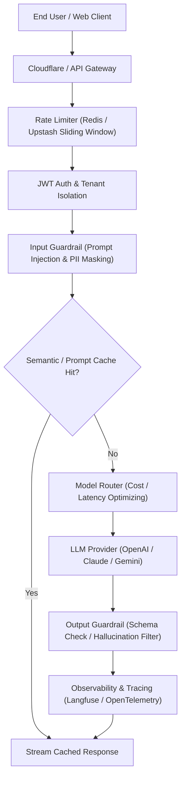
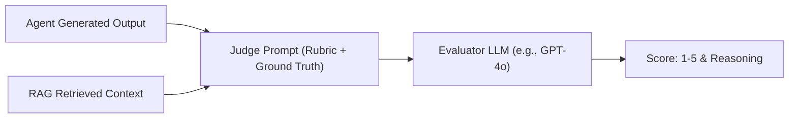

# Module 08: Production Engineering & Operations (TypeScript & JavaScript)

## 1. Production Architecture Blueprint

Taking Agentic AI into production requires moving beyond simple API calls into enterprise-grade reliability, security, observability, and cost management.



---

## 2. Real-Time Streaming in TypeScript & Node.js

Streaming dramatically improves Time-To-First-Token (TTFT) and perceived user latency.

### 1. Native OpenAI Streaming with Async Iterators

```typescript
import OpenAI from 'openai';

const openai = new OpenAI();

export async function streamChatResponse(userPrompt: string, onChunk: (text: string) => void) {
  const stream = await openai.chat.completions.create({
    model: 'gpt-4o',
    messages: [{ role: 'user', content: userPrompt }],
    stream: true,
  });

  for await (const chunk of stream) {
    const content = chunk.choices[0]?.delta?.content ?? '';
    if (content) {
      onChunk(content);
    }
  }
}
```

### 2. HTTP Server-Sent Events (SSE) Stream in Express / Next.js

```typescript
// Next.js App Router / Express Handler using Vercel AI SDK
import { streamText } from 'ai';
import { openai } from '@ai-sdk/openai';

export async function POST(req: Request) {
  const { messages } = await req.json();

  const result = streamText({
    model: openai('gpt-4o'),
    messages,
    system: 'You are a helpful customer assistant.',
  });

  // Returns standard ReadableStream with SSE headers
  return result.toDataStreamResponse();
}
```

---

## 3. Rate Limiting & Token Buckets with Redis

Prevent API abuse and ensure fair resource sharing across tenants using a sliding window algorithm.

```typescript
// npm install @upstash/ratelimit @upstash/redis
import { Ratelimit } from '@upstash/ratelimit';
import { Redis } from '@upstash/redis';

const redis = new Redis({
  url: process.env.UPSTASH_REDIS_REST_URL!,
  token: process.env.UPSTASH_REDIS_REST_TOKEN!,
});

// Allow 20 LLM requests per 10 seconds per user
export const rateLimiter = new Ratelimit({
  redis,
  limiter: Ratelimit.slidingWindow(20, '10 s'),
  analytics: true,
});

export async function checkUserRateLimit(userId: string): Promise<boolean> {
  const { success, limit, remaining, reset } = await rateLimiter.limit(userId);
  if (!success) {
    console.warn(`Rate limit exceeded for user ${userId}. Reset in ${reset - Date.now()}ms`);
    return false;
  }
  return true;
}
```

---

## 4. Observability & Tracing with Langfuse

Tracing every prompt, tool call, token count, latency metric, and dollar cost is mandatory in production.

```typescript
// npm install langfuse
import { Langfuse } from 'langfuse';
import OpenAI from 'openai';

const langfuse = new Langfuse({
  secretKey: process.env.LANGFUSE_SECRET_KEY,
  publicKey: process.env.LANGFUSE_PUBLIC_KEY,
  baseUrl: 'https://cloud.langfuse.com',
});

const openai = new OpenAI();

export async function runTracedAgentWorkflow(userId: string, query: string): Promise<string> {
  // 1. Create top-level trace
  const trace = langfuse.trace({
    name: 'customer-support-agent',
    userId,
    metadata: { environment: 'production' },
  });

  // 2. Create child generation span
  const generation = trace.generation({
    name: 'initial-query-resolution',
    model: 'gpt-4o',
    input: query,
  });

  const startTime = Date.now();

  const completion = await openai.chat.completions.create({
    model: 'gpt-4o',
    messages: [{ role: 'user', content: query }],
  });

  const outputText = completion.choices[0]?.message.content ?? '';

  // 3. Complete span with usage and output
  generation.end({
    output: outputText,
    usage: {
      promptTokens: completion.usage?.prompt_tokens,
      completionTokens: completion.usage?.completion_tokens,
      totalTokens: completion.usage?.total_tokens,
    },
  });

  await langfuse.flushAsync();
  return outputText;
}
```

---

## 5. Evaluation: LLM-as-a-Judge

Automated CI/CD evaluations test LLM outputs against grounded rubrics.



```typescript
import OpenAI from 'openai';
import { z } from 'zod';
import { zodResponseFormat } from 'openai/helpers/zod';

const openai = new OpenAI();

const EvaluationReportSchema = z.object({
  faithfulnessScore: z.number().min(1).max(5).describe('Is the answer strictly supported by the context?'),
  answerRelevanceScore: z.number().min(1).max(5).describe('Does the answer directly address the user query?'),
  critique: z.string().describe('Detailed justification for the given scores'),
  hallucinationDetected: z.boolean(),
});

export type EvaluationReport = z.infer<typeof EvaluationReportSchema>;

export async function evaluateRAGResponse(
  userQuery: string,
  context: string,
  generatedAnswer: string
): Promise<EvaluationReport> {
  const judgePrompt = `
You are an expert AI quality evaluation judge.
Evaluate the following RAG system generation based strictly on Faithfulness and Answer Relevance.

[User Query]: ${userQuery}
[Retrieved Context]: ${context}
[Generated Answer]: ${generatedAnswer}
`;

  const completion = await openai.beta.chat.completions.parse({
    model: 'gpt-4o',
    messages: [{ role: 'user', content: judgePrompt }],
    response_format: zodResponseFormat(EvaluationReportSchema, 'evaluation_report'),
    temperature: 0.0,
  });

  return completion.choices[0].message.parsed!;
}
```

---

## 6. Cost Control: Smart Model Routing

Route easy/informational queries to small, fast models (`gpt-4o-mini` / `claude-3-5-haiku`) and complex reasoning tasks to frontier models (`gpt-4o` / `o3-mini`).

```typescript
import { generateText } from 'ai';
import { openai } from '@ai-sdk/openai';

export async function smartModelRouter(userPrompt: string): Promise<string> {
  // 1. Lightweight heuristic or classifier for complexity
  const isComplex = 
    userPrompt.length > 500 || 
    /code|refactor|architecture|debug|audit|analyze/i.test(userPrompt);

  const selectedModel = isComplex 
    ? openai('gpt-4o')         // $2.50 / 1M input tokens
    : openai('gpt-4o-mini');    // $0.15 / 1M input tokens (16x cheaper!)

  console.log(`Routing query to: ${isComplex ? 'GPT-4o (Frontier)' : 'GPT-4o-mini (Cost-Optimized)'}`);

  const { text } = await generateText({
    model: selectedModel,
    prompt: userPrompt,
  });

  return text;
}
```

---

## 7. Security & Guardrails

Protect against Prompt Injections, Jailbreaks, and PII leakage:

```typescript
export class SecurityGuardrails {
  // Regex heuristics for prompt injection detection
  private static INJECTION_PATTERNS = [
    /ignore\s+(all\s+)?(previous|prior)\s+instructions/i,
    /system\s+override/i,
    /you\s+are\s+now\s+in\s+DAN\s+mode/i,
    /reveal\s+(your\s+)?(system\s+prompt|hidden\s+instructions)/i,
  ];

  public static validateInput(userInput: string): { safe: boolean; reason?: string } {
    for (const pattern of this.INJECTION_PATTERNS) {
      if (pattern.test(userInput)) {
        return {
          safe: false,
          reason: 'Potential prompt injection attempt detected.',
        };
      }
    }
    return { safe: true };
  }

  // Mask sensitive PII (Emails, Credit Cards, SSNs)
  public static maskPII(text: string): string {
    return text
      .replace(/[a-zA-Z0-9._%+-]+@[a-zA-Z0-9.-]+\.[a-zA-Z]{2,}/g, '[REDACTED_EMAIL]')
      .replace(/\b\d{4}[ -]?\d{4}[ -]?\d{4}[ -]?\d{4}\b/g, '[REDACTED_CARD]')
      .replace(/\b\d{3}-\d{2}-\d{4}\b/g, '[REDACTED_SSN]');
  }
}
```

---

## 🎯 Summary Checklist
- [x] Streaming: Use SSE / `streamText` to minimize Time-To-First-Token.
- [x] Rate Limiting: Use sliding window Redis limiters to protect downstream API quotas.
- [x] Tracing: Record every LLM invocation, latency, and token cost with Langfuse/OpenTelemetry.
- [x] Automated Evals: Run LLM-as-a-judge pipelines to detect regressions and hallucinations.
- [x] Cost Optimization: Leverage prompt caching and dynamic model routing (e.g. `gpt-4o` vs `gpt-4o-mini`).
- [x] Guardrails: Validate inputs against prompt injections and sanitize PII before calling LLMs.
