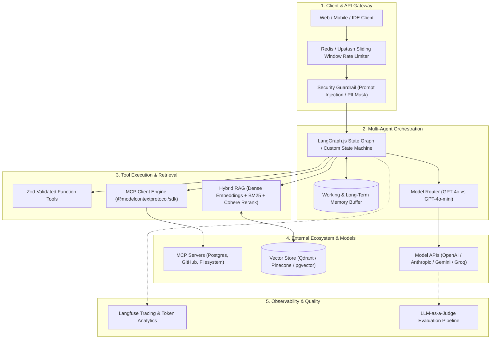

# Agentic AI & Modern LLM Engineering (TypeScript & JavaScript)

A comprehensive, production-grade learning guide and reference covering the full spectrum of Agentic AI, Large Language Models, Model Context Protocol (MCP), and multi-agent system design using **JavaScript & TypeScript**.

---

## 📑 Curriculum & Table of Contents

| Module | Chapter Title | Core Topics | Document Link |
| :--- | :--- | :--- | :--- |
| **01** | **[LLM Fundamentals](file:///c:/Sangam/LEARN/agentic-ai-notes/01-llm-fundamentals.md)** | Tokens (`gpt-tokenizer`), Context Windows, Sampling (`temperature`, `top_p`), Roles, Structured Output with **Zod** & `zodResponseFormat` | [01-llm-fundamentals.md](file:///c:/Sangam/LEARN/agentic-ai-notes/01-llm-fundamentals.md) |
| **02** | **[LLM APIs & Providers](file:///c:/Sangam/LEARN/agentic-ai-notes/02-llm-apis.md)** | OpenAI Node SDK, Anthropic Claude SDK (Prompt Caching & Thinking), Google Gemini SDK (`@google/genai`), Groq/Ollama/DeepSeek, Vercel AI SDK | [02-llm-apis.md](file:///c:/Sangam/LEARN/agentic-ai-notes/02-llm-apis.md) |
| **03** | **[Tool Calling](file:///c:/Sangam/LEARN/agentic-ai-notes/03-tool-calling.md)** | Function Calling mechanics, JSON Schema, Zod Tool Signatures, Parallel Tool Execution Loop, Self-Healing Error Feedback | [03-tool-calling.md](file:///c:/Sangam/LEARN/agentic-ai-notes/03-tool-calling.md) |
| **04** | **[RAG (Retrieval-Augmented Generation)](file:///c:/Sangam/LEARN/agentic-ai-notes/04-rag.md)** | Dense/Sparse Embeddings, Recursive Text Chunking, Vector Math (Cosine Similarity), Hybrid Search & Reciprocal Rank Fusion (RRF), Cross-Encoder Reranking | [04-rag.md](file:///c:/Sangam/LEARN/agentic-ai-notes/04-rag.md) |
| **05** | **[Autonomous Agents](file:///c:/Sangam/LEARN/agentic-ai-notes/05-agents.md)** | Single-Agent Cognitive Loop, ReAct Framework, Plan-and-Solve, Memory Buffer, Loop Prevention, Zero-Framework ReAct Agent in TypeScript | [05-agents.md](file:///c:/Sangam/LEARN/agentic-ai-notes/05-agents.md) |
| **06** | **[Agent Orchestration](file:///c:/Sangam/LEARN/agentic-ai-notes/06-agent-orchestration.md)** | Multi-Agent Patterns (Supervisor, Router, Swarm), **LangGraph.js** (`@langchain/langgraph`), Vercel AI SDK Agent Handoffs, Custom State Machines | [06-agent-orchestration.md](file:///c:/Sangam/LEARN/agentic-ai-notes/06-agent-orchestration.md) |
| **07** | **[Model Context Protocol (MCP)](file:///c:/Sangam/LEARN/agentic-ai-notes/07-mcp.md)** | MCP Architecture, Primitives (Tools, Resources, Prompts), Stdio & SSE Transports, Building TypeScript MCP Servers & Clients with `@modelcontextprotocol/sdk` | [07-mcp.md](file:///c:/Sangam/LEARN/agentic-ai-notes/07-mcp.md) |
| **08** | **[Production Engineering](file:///c:/Sangam/LEARN/agentic-ai-notes/08-production.md)** | SSE Streaming, Redis Sliding Window Rate Limiting, Langfuse Tracing & Observability, LLM-as-a-Judge Evaluation, Cost Routing, Security Guardrails | [08-production.md](file:///c:/Sangam/LEARN/agentic-ai-notes/08-production.md) |

---

## 🗺️ TypeScript AI Stack Architecture



---

## 📦 Key npm Packages Used in This Guide

```bash
# Core Provider SDKs
npm install openai @anthropic-ai/sdk @google/genai

# Vercel AI SDK (Unified multi-provider layer)
npm install ai @ai-sdk/openai @ai-sdk/anthropic @ai-sdk/google

# Schema Validation & Tokens
npm install zod zod-to-json-schema gpt-tokenizer

# Multi-Agent State Graph Orchestration
npm install @langchain/langgraph @langchain/core @langchain/openai

# Model Context Protocol (MCP)
npm install @modelcontextprotocol/sdk

# RAG, Vector & Reranking
npm install cohere-ai @pinecone-database/pinecone @qdrant/js-client-rest

# Production Ops, Tracing & Rate Limiting
npm install langfuse @upstash/ratelimit @upstash/redis
```

---

## 🚀 Recommended Step-by-Step Study Flow

1. Start with **[01-llm-fundamentals.md](file:///c:/Sangam/LEARN/agentic-ai-notes/01-llm-fundamentals.md)** to master tokens, sampling, and structured outputs with **Zod**.
2. Learn how to invoke all major model providers in **[02-llm-apis.md](file:///c:/Sangam/LEARN/agentic-ai-notes/02-llm-apis.md)**.
3. Master Function Calling and self-healing error loops in **[03-tool-calling.md](file:///c:/Sangam/LEARN/agentic-ai-notes/03-tool-calling.md)**.
4. Implement dense vectors, hybrid search, and cross-encoder rerankers in **[04-rag.md](file:///c:/Sangam/LEARN/agentic-ai-notes/04-rag.md)**.
5. Build an autonomous ReAct loop from scratch in TypeScript in **[05-agents.md](file:///c:/Sangam/LEARN/agentic-ai-notes/05-agents.md)**.
6. Scale to complex multi-agent state machines with LangGraph.js in **[06-agent-orchestration.md](file:///c:/Sangam/LEARN/agentic-ai-notes/06-agent-orchestration.md)**.
7. Integrate external servers using the Model Context Protocol standard in **[07-mcp.md](file:///c:/Sangam/LEARN/agentic-ai-notes/07-mcp.md)**.
8. Ship to production with streaming, rate limiting, Langfuse tracing, and security guardrails in **[08-production.md](file:///c:/Sangam/LEARN/agentic-ai-notes/08-production.md)**.
